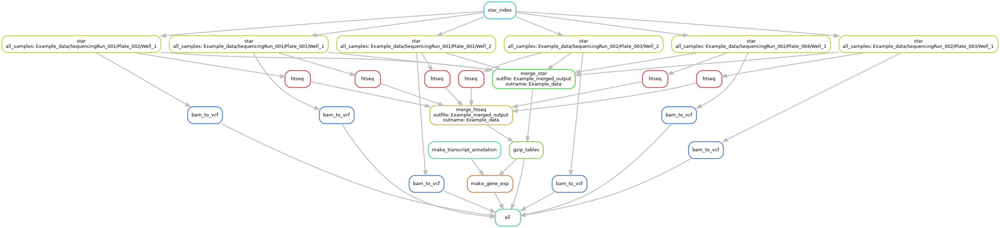

# singleCell_snake
Snakemake pipeline for STAR alignment + htseq-count expression quantification for Smart-seq2 workflow.

DAG illustration of pipeline workflow
-------------------------------------


Work in progress
----------------
~~+ Add support for transcript to gene matrix transformation~~

~~+ Modularize rules~~

~~+ Add sample dataset~~

~~+ single-cell variant counting analysis~~

~~+ TPM normalization~~

+ There are some issues with the transcript to gene conversion. Need to re-validate "rules/feature_to_gene.smk" and the related function in "Snakefile_utils.py"

+ Now: Enable support for chunky STAR alignment and htseq-count to save memory loading time.
+ Future: Add support for writing to anndata object

Prerequisites
-------------
+ STAR v2.60+
+ htseq-count v0.10.0+
+ Python 3+, Pandas, numpy
+ samtools v1.8+
+ bcftools v1.8+
~~+ picard (for TPM normalization)~~
~~+ R (picard CollectInsertMetrics requires R as a prequisite tool)~~

Cluster configuration
---------------------
Please configure values for PARTITION and EMAIL in "do.sh" so I don't receive emails about your completed jobs.

TO-DO: Detailed instructions on loading proper modules on cluster.

Usage
-----
+ Modify parameters of yaml under config/

Replace {CUSTOM.YAML} with matching config.yaml under config/
Submit remote master job on cluster 
```bash
sh do.sh {CUSTOM.YAML}
```

To do a dry/unlock/forceall/forcerun run
```bash
sh do.sh {CUSTOM.YAML} dry
```

To do a local run
```bash
sh do.sh {CUSTOM.YAML} local
```

To run a specific rule
```bash
sh do.sh {CUSTOM.YAML} cluster htseq
```
